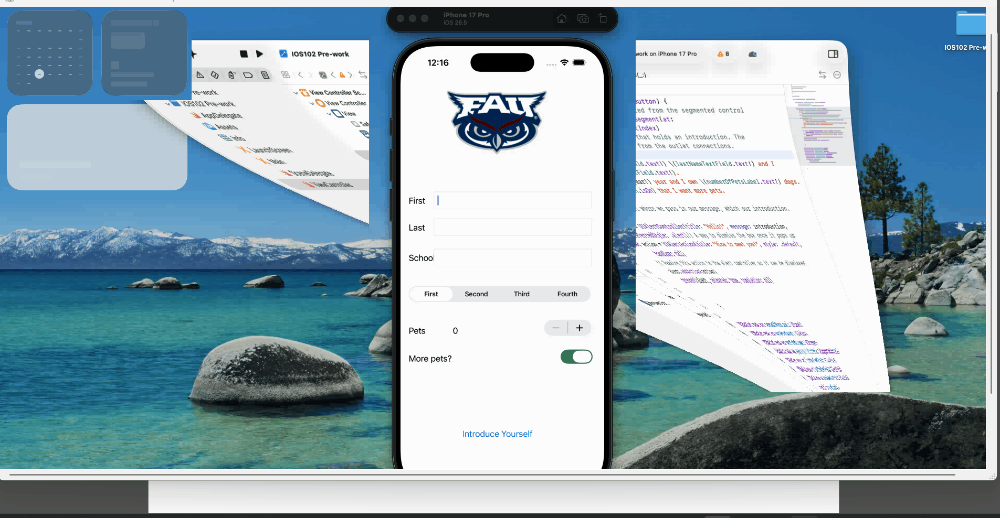

# FAU Student Intro App

## App Description
An iOS app where a student can enter their personal information (name, school, year, and pet details) and generate a fun introduction that's displayed in an alert. Built as part of iOS102 pre-work to practice IBOutlets and IBActions.

## App Walk-through

## Required Features

The following **required** functionality is completed:

- [x] App displays an image of a school's logo
- [x] App has three textfields for first, last, and school names
- [x] App has a segmented control that changes student year
- [x] Number of pets matches label is increased/decreased by stepper
- [x] Switch makes a statement about wanting more pets or not (true/false)
- [x] Introduce yourself button shows alert box with an introduction and dismiss button

## Optional Features

The following **optional** features are implemented:

- [ ] User can tap a button to change the color of the background view
- [ ] User can select additional buttons that provide more info about the user. Example: more textfields, a different alert box, etc.
- [ ] Any stylistic changes that are not default options (Comment this here)

## Notes

Describe any challenges encountered while building the app here —
*
One of the biggest challenges was connecting outlets and actions through the Assistant 
Editor while using a remote desktop connection to access a Mac. Control-dragging from 
the storyboard into the code was unreliable at first — the key press and mouse drag 
would get out of sync due to input lag. I found that pressing and holding Control 
first, then clicking and dragging, and only releasing Control after the mouse button 
worked much more consistently.

I also ran into a syntax issue when building the multi-line introduction string. I 
initially tried using single double-quotes (`"..."`) to span multiple lines, which 
isn't valid Swift — multi-line strings require triple quotes (`"""..."""`). Once I 
switched to triple-quoted strings, the formatting worked as expected.
## License

    Copyright [2026] [Shahed Ahmed]

    Licensed under the Apache License, Version 2.0 (the "License");
    you may not use this file except in compliance with the License.
    You may obtain a copy of the License at

        http://www.apache.org/licenses/LICENSE-2.0

    Unless required by applicable law or agreed to in writing, software
    distributed under the License is distributed on an "AS IS" BASIS,
    WITHOUT WARRANTIES OR CONDITIONS OF ANY KIND, either express or implied.
    See the License for the specific language governing permissions and
    limitations under the License.
